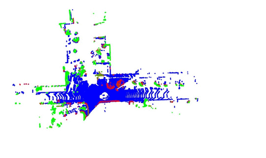

## Description

The repository implements the LOAM algorithm by Zhang et al. (2014) for realtime odometry and mapping using raw LIDAR scans, as a stanalone library.

## Dependencies

The repository is build using Bazel. It assumes local repositories for

- OpenCV
- PCL
- Eigen

Please change the locations if necessary in the WORKSPACE file.

## To Do

- Add some unit / functional tests.
- Remove OpenCV and PCL dependencies, and use just Eigen for portability.
- Add visualization scripts.
- Run with 2-threads (one for odometry, the other for mapping).
